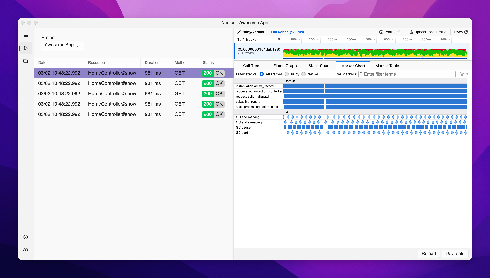

# Nonius



### Lightweight Profiler Viewer for Rails Apps

Nonius is a desktop app that provides a streamlined interface for viewing and managing profiling results from your Rails applications. It integrates seamlessly with the Ruby profiling tool [Vernier](https://github.com/jhawthorn/vernier) and presents profiling data using the powerful [Firefox Profiler](https://profiler.firefox.com/). If you're working with Rails apps and need an efficient way to visualize performance data, Nonius is here to make it simple and fast.

## 📦 Download Now

- **macOS**: <s>[Download the latest release](https://github.com/supermomonga/Nonius/releases)</s> codesign is not ready. please wait a moment.
- **Windows & Linux**: Coming soon!

## 🔥 Key Features

- **Tailored for Rails**: Nonius is designed specifically for Rails applications, making it easy to view profiling data with a UI optimized for common Rails patterns.
- **Multi-App Support**: Manage and analyze profiling data from multiple Rails applications, all within the same interface.
- **Lightweight & Efficient**: Nonius is designed to be fast and minimal, ensuring that you can quickly dive into performance insights without bloat or distractions.
- **Seamless Vernier Integration**: Nonius automatically syncs with Vernier profiler to retrieve and display your profiling results.
- **Interactive Filtering**: Easily sift through large profiling data with built-in filtering and search tools (coming soon).

## 🖥️ How It Works

1. **Profile Your Rails App**: Integrate the [Vernier](https://github.com/jhawthorn/vernier) profiler into your Rails app by adding the necessary code. This could be done either via:
   - **Rack Middleware** for monitoring general app performance, or
   - **RSpec Request Specs** for more targeted profiling.

2. **View Results in Nonius**: Once profiling data is collected, simply open Nonius to see the results displayed using the Firefox Profiler interface. Nonius adds additional functionality like profiling data list views and filtering, making it easier to analyze your app's performance.

3. **Optimize Your App**: Use the detailed profiling insights to identify performance bottlenecks and make your Rails app more efficient!

## 📚 Vernier Setup Guide

1. Install [Vernier](https://github.com/jhawthorn/vernier) in your Rails app:

```rb
# Gemfile
group :development, :test do
  gem 'vernier'
end
```

2. Add Vernier profiling hooks, such as in a middleware or test suite:

for RSpec request spec:

```rb
# spec/support/vernier_profiler_support.rb
require 'vernier'
require 'securerandom'

module VernierProfilerSupport
  def get(path, **args) = with_vernier_profiling { super }
  def post(path, **args) = with_vernier_profiling { super }
  def delete(path, **args) = with_vernier_profiling { super }
  def put(path, **args) = with_vernier_profiling { super }
  def patch(path, **args) = with_vernier_profiling { super }
  def head(path, **args) = with_vernier_profiling { super }

  private def with_vernier_profiling
    Vernier.start_profile(
      out: Rails.root.join('tmp/profiling', "#{SecureRandom.uuid}.json").to_s,
      hooks: [:rails]
    )
    result = yield
    Vernier.stop_profile
    return result
  end
end
```

```rb
# spec/rails_helper.rb
if ENV.fetch('ENABLE_VERNIER_PROFILER', false)
  require_relative 'support/vernier_profiler_support'
  RSpec.configure do |config|
    config.include VernierProfilerSupport, type: :request
  end
end
```

for Rails server:

```rb
# lib/rack/vernier_profiler.rb
require 'vernier'
require 'securerandom'

class VernierProfiler
  def initialize(app)
    FileUtils.mkdir_p(Rails.root.join('tmp/profiling'))
    @app = app
  end

  def call(env)
    Vernier.start_profile(out: Rails.root.join('tmp/profiling', "#{SecureRandom.uuid}.json").to_s, hooks: [:rails])
    status, headers, response = @app.call(env)
    Vernier.stop_profile
    return [status, headers, response]
  end
end
```

```rb
# config/environments/development.rb
require "active_support/core_ext/integer/time"

Rails.application.configure do
  if ENV.fetch('ENABLE_VERNIER_PROFILER', false)
    require_relative '../../lib/rack/vernier_profiler'
    config.middleware.use VernierProfiler
  end
end
```


3. Create a new project in Nonius, and configure profile data directory. In this case, `your_rails_app_root_dir/tmp/profiling` is the data directory.
4. Start analyzing!


## 🚀 Roadmap

- Offline Mode: Currently, Nonius relies on vernier's hosted profiler web interface ( https://vernier.prof/ ). An offline mode is planned to ensure full functionality without internet access.
- Advanced Filtering: More powerful filtering and search capabilities, similar to Datadog, will soon be available for deep analysis of your profiling data.

## 🛠️ Contribution

We welcome contributions! If you find bugs or have feature suggestions, feel free to open an issue or submit a pull request.

## 📄 License

Nonius is open-source and available under the MIT License. See the LICENSE file for more information.

---

Happy profiling! 🎯
